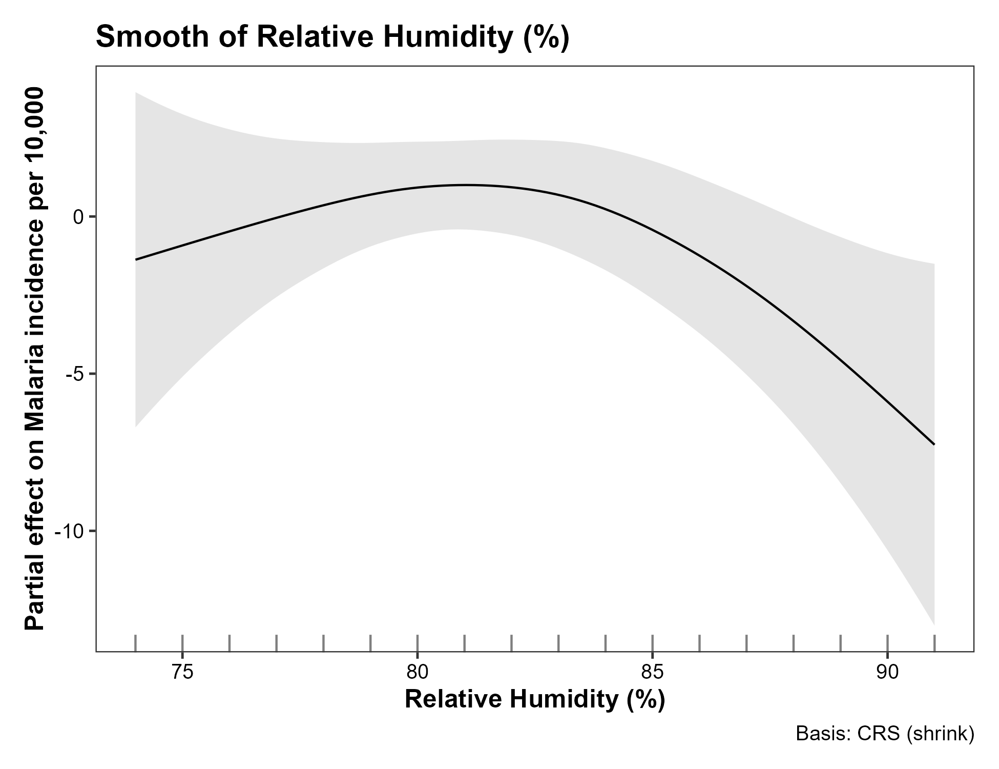
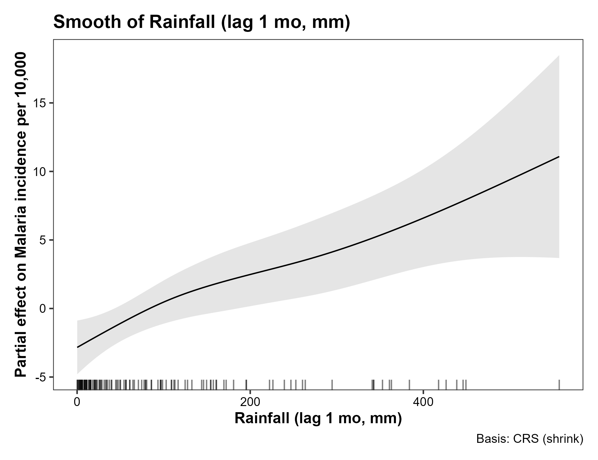
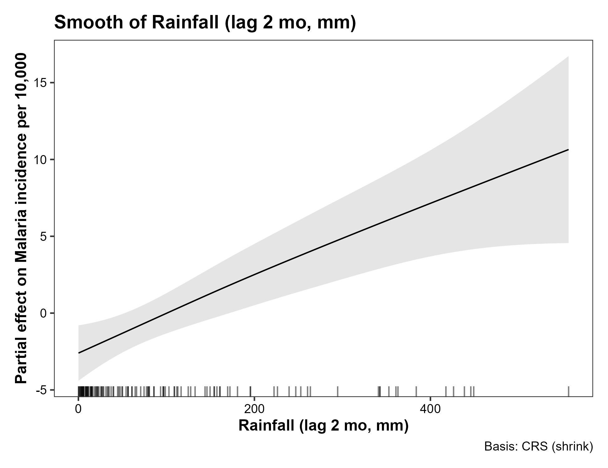
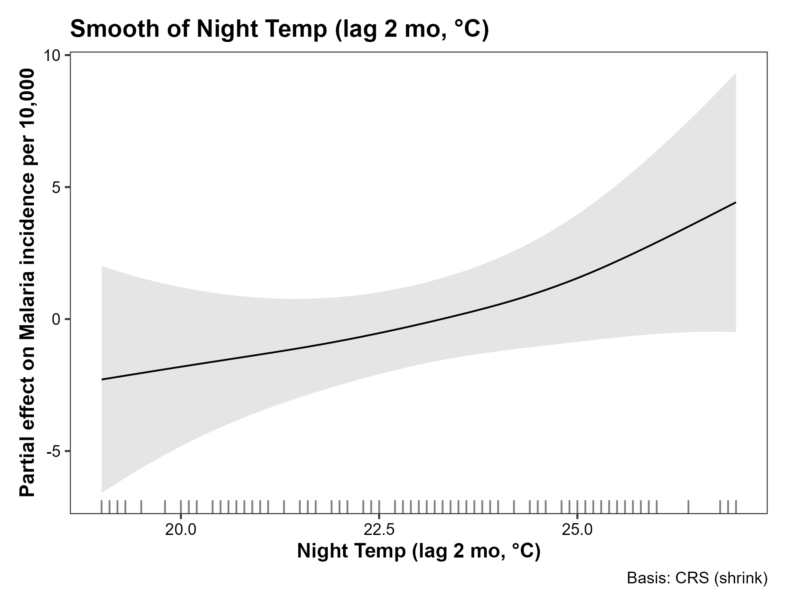

# Results

## Temporal patterns and trends of malaria incidence

The monthly malaria incidence in Dar es Salaam from January 2014 to October 2024 exhibited a general declining trend over the study period (Fig. 1). The time series demonstrated substantial month-to-month variability with peak incidence values exceeding 180 cases per 10,000 population observed in 2014-2015, while values decreased to below 50 cases per 10,000 population by 2024. Annual mean malaria incidence showed a consistent downward trend from 2014 to 2024, with the highest annual mean incidence recorded in 2014 (139.8 ± 25.3 cases per 10,000) and the lowest observed in 2023 (22.4 ± 11.2 cases per 10,000) (Fig. 2).

Analysis of seasonal patterns revealed distinct malaria incidence peaks throughout the year (Fig. 3). The highest average malaria incidence occurred during the long rainy season (March-May, MAM), followed by the transition period (September, S). The long dry season (June-August, JJA) showed the lowest average incidence, while the short dry season (January-February, JF) and short rainy season (October-December, OND) exhibited intermediate levels. The monthly decomposition analysis confirmed a strong seasonal component in malaria incidence, with peak months identified as April (mean: 153.1 cases per 10,000), May (mean: 180.4 cases per 10,000), and March (mean: 145.0 cases per 10,000) (Fig. 4).

## Climate variable patterns

Daytime and nighttime temperatures showed consistent seasonal patterns throughout the study period (Fig. 5). Daytime temperatures ranged from approximately 26°C to 34°C, with peak values typically occurring during the short dry season (December-February). Nighttime temperatures exhibited less variability, ranging from 19°C to 27°C, with similar seasonal patterns to daytime temperatures. Monthly rainfall displayed high variability with pronounced seasonal peaks during the long rainy season (March-May) and short rainy season (October-December). Rainfall amounts ranged from near zero during dry periods to over 400 mm during peak rainy months. Relative humidity remained consistently high throughout the year, ranging from 75% to 91%, with slightly higher values during the rainy seasons.

## Seasonal trend decomposition analysis

The STL decomposition of malaria incidence revealed three distinct components (Fig. 6). The trend component showed a clear long-term decline from 2014 to 2024, with the steepest decrease occurring between 2016 and 2018. The seasonal component exhibited a strong annual cycle with peak values during April-May and trough values during August-September. The residual component demonstrated relatively low variability, indicating that the trend and seasonal components captured most of the temporal variation in malaria incidence.

STL decomposition analysis comparing malaria incidence with climate variables revealed distinct seasonal relationships (Figs. 7-10). The seasonal components showed that malaria peaks lagged rainfall peaks by approximately 1-2 months, with rainfall seasonal peaks occurring in March-April and malaria seasonal peaks occurring in April-May (Fig. 7). Both daytime and nighttime temperature seasonal patterns showed moderate correlation with malaria seasonality, with temperature peaks during the short dry season (December-February) preceding malaria peaks by 2-3 months (Figs. 8-9). Relative humidity seasonal patterns showed the strongest correlation with malaria seasonality, with both variables peaking during the long rainy season (March-May) (Fig. 10).

## Generalized additive model results

The GAM model achieved excellent fit with an adjusted R² of 0.975 and explained 97.9% of the deviance in malaria incidence (Table 1). The model included 127 observations spanning the study period and utilized shrinkage cubic regression splines with REML estimation. The temporal trend component (year-month) was highly significant (edf = 7.633, F = 418.094, p < 0.001), confirming the strong long-term decline in malaria incidence independent of climate effects.

Among current month effects, daytime temperature showed a significant nonlinear relationship with malaria incidence (edf = 1.454, F = 0.886, p = 0.007), while relative humidity exhibited a significant nonlinear effect (edf = 2.093, F = 0.928, p = 0.012). Nighttime temperature and monthly rainfall showed no significant current month effects. Analysis of lagged effects revealed that daytime temperature with 1-month lag showed the strongest effect (edf = 3.428, F = 2.501, p < 0.001), followed by rainfall at both 1-month lag (edf = 1.810, F = 2.182, p < 0.001) and 2-month lag (edf = 1.316, F = 2.517, p < 0.001). Nighttime temperature with 2-month lag was also significant (edf = 1.288, F = 0.385, p = 0.024).

Analysis of the smooth term relationships revealed threshold effects for temperature variables and positive relationships for humidity and rainfall (Figs. 11-15). Daytime temperature current month effects showed a threshold relationship, with malaria incidence increasing at higher temperatures above approximately 32°C. The 1-month lag effect demonstrated a more complex nonlinear relationship with peak effects around 31-33°C. Relative humidity current month effects showed a positive relationship, with malaria incidence increasing as humidity rises above 80%. Both 1-month and 2-month lag rainfall effects showed positive relationships with malaria incidence, with effects becoming more pronounced at rainfall amounts above 200 mm per month. Nighttime temperature 2-month lag effect showed a threshold relationship, with malaria incidence increasing at nighttime temperatures above 22°C.

## Descriptive statistics

The study period encompassed 127 monthly observations with malaria incidence showing a mean of 94.8 cases per 10,000 (SD = 45.2, range: 12.0-180.4). Climate variables demonstrated the following patterns: daytime temperature mean = 31.1°C (SD = 2.1, range: 24.9-34.3°C), nighttime temperature mean = 22.6°C (SD = 2.3, range: 19.0-27.0°C), monthly rainfall mean = 115.8 mm (SD = 144.1, range: 0.1-557.0 mm), and relative humidity mean = 81.2% (SD = 4.9, range: 75.0-91.0%). The correlation analysis revealed moderate positive correlations between malaria incidence and daytime temperature (r = 0.42), rainfall (r = 0.38), and relative humidity (r = 0.31), while nighttime temperature showed a weaker correlation (r = 0.18) (Fig. 5).
